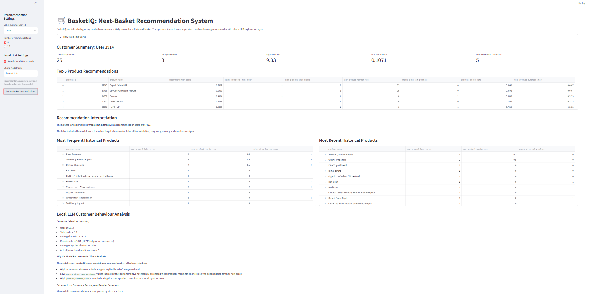

# BasketIQ: Next-Basket Recommendation with ML and Local LLM Analysis

**Author:** Telman Maghrebi  
**Role:** Data Scientist  

BasketIQ is a machine learning and GenAI-style analytics project for personalised grocery next-basket recommendation.

The project predicts which products a customer is likely to reorder in their next grocery basket using historical order behaviour. It combines supervised machine learning, Bayesian hyperparameter optimisation, ensemble modelling, top-K recommendation evaluation, and a local lightweight LLM explanation layer.

---

## 1. Project Objective

Online grocery customers often reorder products they previously purchased, especially staple items such as milk, bread, fruit, vegetables, eggs and household essentials.

The goal of BasketIQ is to build a recommendation system that answers:

> For this customer and this product, how likely is the customer to reorder it in the next basket?

The final output is a ranked list of recommended products for each customer.

---

## 2. Business Problem

A grocery retailer can use next-basket recommendation to:

- Personalise the online shopping experience
- Help customers quickly find repeat-purchase products
- Reduce product search friction
- Improve basket-building convenience
- Support personalised marketing and customer engagement
- Surface relevant products based on historical behaviour

---

## 3. Machine Learning Problem

This project is framed as a supervised binary classification and ranking problem.

Each row in the modelling dataset represents:

```text
user_id + product_id
```

The target variable is:

```text
reordered_next_order
```

Target definition:

```text
1 = customer reordered the product in the next labelled order
0 = customer did not reorder the product in the next labelled order
```

Although the model is trained as a classifier, the final business output is a ranked recommendation list based on predicted reorder probability.

---

## 4. Dataset

The project uses the Instacart Market Basket Analysis dataset.

The dataset can be downloaded from Kaggle:

```text
https://www.kaggle.com/datasets/psparks/instacart-market-basket-analysis
```

Automatic download using Kaggle CLI:

```powershell
kaggle datasets download -d psparks/instacart-market-basket-analysis -p .\data\raw --unzip
```

Expected raw files:

```text
data/raw/
├── aisles.csv
├── departments.csv
├── orders.csv
├── products.csv
├── order_products__prior.csv
└── order_products__train.csv
```

Raw data files are not committed to GitHub.

---

## 5. Project Structure

```text
basketiq-next-basket-recommendation/
│
├── app/
│   └── streamlit_app.py
│
├── data/
│   ├── raw/
│   └── processed/
│
├── reports/
│   ├── figures/
│   ├── preprocessing_and_eda_report.md
│   └── model_selection_report.md
│
├── src/
│   └── basketiq/
│       ├── __init__.py
│       ├── config.py
│       ├── data_checks.py
│       ├── features.py
│       ├── preprocessing_and_eda_visuals.py
│       ├── models.py
│       ├── train.py
│       ├── train_bayesian_optimization.py
│       ├── generate_model_selection_report.py
│       ├── recommend.py
│       └── llm_customer_analysis.py
│
├── tests/
├── requirements.txt
├── .gitignore
└── README.md
```

---

## 6. End-to-End Workflow

### Step 1: Create and activate virtual environment

```powershell
python -m venv .venv
.venv\Scripts\Activate
```

### Step 2: Install dependencies

```powershell
pip install -r requirements.txt
```

### Step 3: Download raw data

```powershell
kaggle datasets download -d psparks/instacart-market-basket-analysis -p .\data\raw --unzip
```

### Step 4: Check raw data

```powershell
python -m src.basketiq.data_checks
```

### Step 5: Build engineered training dataset

```powershell
python -m src.basketiq.features
```

This creates:

```text
data/processed/training_data.parquet
```

### Step 6: Generate preprocessing and EDA report

```powershell
python -m src.basketiq.preprocessing_and_eda_visuals
```

This creates:

```text
reports/preprocessing_and_eda_report.md
reports/figures/
```

### Step 7: Train models with Bayesian optimisation and voting classifiers

```powershell
python -m src.basketiq.train_bayesian_optimization
```

This creates:

```text
data/processed/bayesian_optimization_results.csv
data/processed/tuned_model_comparison.csv
data/processed/tuned_models/
```

### Step 8: Generate model selection report

```powershell
python -m src.basketiq.generate_model_selection_report
```

This creates:

```text
reports/model_selection_report.md
```

### Step 9: Run recommendation app

```powershell
streamlit run app\streamlit_app.py
```

---

## 7. Feature Engineering

The raw data is transformed into a user-product modelling table.

Main raw data sources:

| Raw Dataset | Purpose |
|---|---|
| `orders.csv` | User order history and order sequence |
| `order_products__prior.csv` | Historical products purchased by customers |
| `order_products__train.csv` | Products in the labelled next order |
| `products.csv` | Product metadata |
| `aisles.csv` | Aisle metadata |
| `departments.csv` | Department metadata |

The final modelling table is created by joining:

| Component | Join Key |
|---|---|
| Prior orders and prior products | `order_id` |
| User-product features and user features | `user_id` |
| User-product features and product features | `product_id` |
| Product metadata | `product_id` |
| Target labels | `user_id`, `product_id` |

---

## 8. Engineered Features

The model uses customer-product, customer-level and product-level features.

Examples:

| Feature | Meaning |
|---|---|
| `user_product_total_orders` | How many times the customer bought the product |
| `user_product_total_reorders` | How many times the customer reordered the product |
| `user_product_avg_cart_order` | Average position where product was added to basket |
| `user_product_last_order_number` | Last order number where customer bought the product |
| `user_total_orders` | Number of prior orders for the customer |
| `user_avg_days_since_prior_order` | Average time between customer orders |
| `user_avg_basket_size` | Average basket size for the customer |
| `user_reorder_rate` | Customer-level reorder tendency |
| `product_total_purchases` | Product popularity |
| `product_total_reorders` | Product-level reorder count |
| `product_reorder_rate` | Product-level reorder rate |
| `product_first_cart_rate` | How often product is added first to basket |
| `user_product_reorder_rate` | Personalised product reorder rate |
| `orders_since_last_purchase` | Recency signal |
| `user_product_purchase_share` | Product importance within customer history |

Log-transformed versions of skewed count features are also added using `log1p`.

This helps reduce the influence of extreme values while preserving useful order and frequency information.

---

## 9. Class Imbalance Handling

The target is imbalanced because most historical customer-product pairs are not reordered in the next basket.

To address this:

- Random undersampling is applied only to the training set
- The test set keeps the original imbalanced distribution
- PR-AUC, F1, Precision@K and Recall@K are used for model selection

This reflects a realistic recommendation setting.

---

## 10. Models Evaluated

The project benchmarks multiple supervised machine learning models:

### Simple and baseline methods

- Logistic Regression
- k-Nearest Neighbours
- Linear SVM

### Tree-based methods

- Decision Tree
- Random Forest
- XGBoost
- LightGBM
- CatBoost

### Ensemble methods

- Soft Voting Classifier using all tuned models
- Weighted Soft Voting Classifier using XGBoost, LightGBM and CatBoost
- Hard Voting Classifier using all tuned models
- Hard Voting Classifier using XGBoost, LightGBM and CatBoost

Bayesian optimisation is used to tune model hyperparameters.

---

## 11. Evaluation Metrics

The models are evaluated using classification metrics and recommendation metrics.

Classification metrics:

- Accuracy
- Precision
- Recall
- F1-score
- ROC-AUC
- PR-AUC

Recommendation metrics:

- Precision@5
- Recall@5
- Precision@10
- Recall@10

For this project, Recall@K is especially important because the recommendation system should capture products the customer is likely to reorder.

Precision@K is also monitored to ensure the recommendation list remains relevant.

---

## 12. Champion Model

The final champion model is selected automatically from:

```text
data/processed/tuned_model_comparison.csv
```

The model selection report is generated with:

```powershell
python -m src.basketiq.generate_model_selection_report
```

The selected model is expected to be the best performer by PR-AUC, while also considering F1-score, Precision@K and Recall@K.

In the current experiment, the strongest model is the weighted soft voting ensemble using:

```text
XGBoost + LightGBM + CatBoost
```

This ensemble provides probability scores that are suitable for product ranking.

---

## 13. Recommendation App

The Streamlit app allows a user to:

- Select a customer `user_id`
- Generate top 5 or top 10 recommendations
- View model recommendation scores
- View actual target values for offline validation
- Inspect customer summary statistics
- Inspect frequent historical products
- Inspect recent historical products
- Optionally generate local LLM analysis

Run the app:

```powershell
streamlit run app\streamlit_app.py
```

---

## Streamlit App Screenshot

### Customer Recommendations



---

## 14. Local LLM Customer Analysis

BasketIQ includes a lightweight local LLM analysis layer using Ollama.

The ML model predicts and ranks products.  
The local LLM explains the recommendations using customer history and model output.

The LLM analysis looks at:

- Customer shopping summary
- Top recommended products
- Most frequent historical products
- Most recent historical products
- Frequency signals
- Recency signals
- Reorder-rate signals

Install Ollama from:

```text
https://ollama.com/download
```

Download a lightweight local model:

```powershell
ollama pull llama3.2:3b
```

Install Python client:

```powershell
pip install ollama
```

Run local LLM customer analysis:

```powershell
python -m src.basketiq.llm_customer_analysis
```

The Streamlit app can also trigger the local LLM explanation if Ollama is running.

---

## 15. Example Recommendation Output

Example top-k output:

| product_id | product_name | recommendation_score | actual_reordered_next_order |
|---:|---|---:|---:|
| 24852 | Banana | 0.8421 | 1 |
| 13176 | Bag of Organic Bananas | 0.7763 | 1 |
| 21137 | Organic Strawberries | 0.6412 | 0 |

The recommendation score is:

```text
P(reordered_next_order = 1)
```

A higher score means the model believes the product is more likely to be reordered.

---

## 16. Key Project Strengths

This project demonstrates:

- End-to-end machine learning workflow
- Feature engineering from relational raw datasets
- Handling class imbalance
- Multiple model benchmarking
- Bayesian hyperparameter optimisation
- Ensemble modelling
- Top-K recommendation evaluation
- Streamlit deployment
- Local LLM-powered interpretation
- Business-focused model reporting

---

## 17. CI/CD and Docker

The project includes a lightweight CI/CD pipeline using GitHub Actions.

The pipeline runs automatically on every push and pull request to the `main` branch.

The CI/CD workflow checks:

- Project structure
- Python dependency installation
- Core package imports
- Source-code syntax using `compileall`
- Docker image build

This helps ensure that the repository remains reproducible, maintainable and deployment-ready.

The Docker setup allows the Streamlit recommendation app to run in a containerised environment.

---

## 18. Future Improvements

Potential future extensions:

- Add product aisle and department-level features
- Add time-based customer shopping features
- Add SHAP feature explanations
- Add Neural Collaborative Filtering
- Add Two-Tower deep learning recommender
- Add customer segmentation
- Tune directly for Precision@K or Recall@K
- Add batch recommendation generation for all users
- Deploy as a lightweight API

---

## 19. Notes

The raw data and trained model artifacts are excluded from GitHub using `.gitignore`.

Recommended ignored paths:

```text
.venv/
data/raw/
data/processed/
reports/figures/
*.joblib
*.pkl
```

The repository should contain the source code, documentation and instructions needed to reproduce the project locally.
